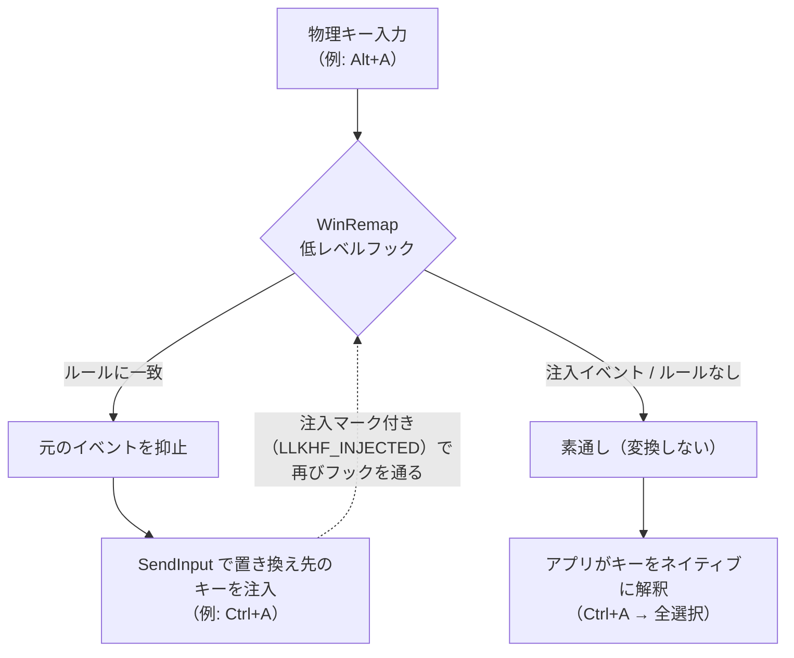

# WinRemap

[](https://github.com/DaikiSuganuma/winremap/actions/workflows/ci.yml)

Rust 製の Windows 用アプリ別キーリマッパー —
[xremap](https://github.com/xremap/xremap)（Linux）と
[Keyhac](https://github.com/crftwr/keyhac-win) に着想を得ています。

> WinRemap は Keyhac の再実装・フォークではなく、影響を受けた独立プロジェクトです。xremap とも無関係です（Inspired by xremap; not affiliated）。

English: [README.md](README.md)

📖 **ヘルプページ:** [daikisuganuma.github.io/winremap/ja/](https://daikisuganuma.github.io/winremap/ja/)
([English](https://daikisuganuma.github.io/winremap/))

## 動作のしくみ

WinRemap がやるのはあくまで**キーストロークの置き換えだけ**で、アプリの機能を直接呼び出すことはありません。低レベルキーボードフックが物理キーイベントを抑止し、`SendInput` で置き換え先のキーを注入します。アプリは注入されたキーを「ユーザーが打ったキー」として受け取り、アプリ自身のネイティブな意味で解釈します。たとえば `A-a` を `C-a` にリマップすれば、アプリの Ctrl+A の動作（通常は全選択）がそのまま動きます。注入イベントはフックを素通しする（再変換しない）ため、ルール同士が連鎖したりループしたりすることはありません。



## 機能（v0.1）

- **アプリ別リマップ**: 指定した exe（`notepad.exe`、`chrome.exe` 等）にだけルールを適用。`*` によるグローバル適用と `exclude`（除外リスト）も可
- **宣言的な TOML 設定**。キー記法（`C-h`、`A-f`、`Back` 等）は Keyhac / fakeymacs ユーザーに馴染む形式
- **2 ストロークシーケンス**（`"A-x h"`、Emacs 風プレフィックスキー）と**マクロ出力**（`"C-t" = ["C-Right", "C-Left", "C-S-Right"]`）
- **タスクトレイ常駐**: 有効/無効トグル、設定のホットリロード、終了
- **IME 状態インジケーター**（opt-in）: IME がオンになった瞬間、アクティブウィンドウ中央に半透明の「あ」パネルを一瞬表示し、現在の入力モードを見失わないようにします。表示のみで、WinRemap が IME を切り替えることはありません
- **UI は日本語・英語対応**。システム言語から自動選択（`--lang en|ja` で上書き可）
- **単一バイナリ・依存なし**
- フックコールバックはヒープ確保・ロック・I/O のない純 Rust。スクリプト駆動のリマッパーと比べ、最悪レイテンシと安定性（GC 停止によるフック切り離しが起きない）が改善します。平均のタイピングレイテンシは同程度です

## クイックスタート

1. [Releases](https://github.com/DaikiSuganuma/winremap/releases) から
   `winremap-setup.exe` をダウンロードして実行します（検証手順は
   [SECURITY.md](SECURITY.md)）。インストーラーは管理者権限不要の
   ユーザー単位インストールで、スタートメニューへの登録、サインイン時の
   自動起動（任意）に対応し、設定ファイルがまだ無い場合は
   `%APPDATA%\winremap\config.toml` を最小サンプルから作成します。

   ポータブル運用にしたい場合は単体の `winremap.exe` をダウンロードするか、
   ソースからビルドしてください:

   ```powershell
   cargo build --release   # -> target\release\winremap.exe
   ```

2. `%APPDATA%\winremap\config.toml` を編集します（例からのコピーでも可）:

   ```toml
   # メモ帳でのみ Ctrl+H を素の Backspace にする
   [[keymap]]
   name = "notepad"
   application = ["notepad.exe"]

   [keymap.remap]
   "C-h" = "Back"
   ```

3. `winremap.exe` を実行するとトレイアイコンが現れ、リマップが有効になります。

   ```powershell
   winremap.exe                     # %APPDATA%\winremap\config.toml を使用
   winremap.exe --config my.toml    # パスを明示
   ```

完全な例は [`examples/minimal.toml`](examples/minimal.toml)、
[`examples/emacs.toml`](examples/emacs.toml)（fakeymacs 風 Emacs キーバインド）、
[`examples/suganuma.toml`](examples/suganuma.toml)（除外リスト・マクロ・プレフィックスシーケンスを使った実運用例）を参照してください。

## 設定

- `application` — 適用先の exe 名（大文字小文字不問）。`["*"]` で全アプリ適用となり、その場合のみ `exclude` で除外 exe を指定可。アプリ別ルールは常に `*` ルールより優先
- キー記法 — 修飾キー `C-`（Ctrl）、`A-`（Alt）、`S-`（Shift）、`W-`（Win）+ キー名: `a`-`z`、`0`-`9`、`F1`-`F24`、`Back`、`Enter`、`Esc`、`Tab`、`Space`、`Delete`、`Home`、`End`、`PageUp`、`PageDown`、矢印キー、`CapsLock`、出力用の左右指定修飾キー（`LCtrl` 等）
- 修飾キー付きルール（`"C-h" = "Back"`）はそのコマンド（修飾キー＋キーの同時押し。英語ドキュメントでは chord）に完全一致し、修飾状態ごと置き換えます（アプリには素の Backspace が届く）。単キールール（`"CapsLock" = "LCtrl"`）は修飾キーの状態に関係なくキーだけを差し替えます
- LHS を 2 ストローク（`"A-x h" = ...`）にすると Emacs 風プレフィックスキーになります（1 打鍵目は抑止され、次の打鍵で確定）。RHS を配列（`["C-Home", "C-S-End"]`、最大 8）にすると各コマンドを順にタップするマクロになります
- トップレベルの `macro_delay_ms = 8`（0-15）で、マクロの各ストローク間に待ち時間を入れられます。一括注入を取りこぼすアプリ（WinUI 版メモ帳等）向けの設定で、CLI の `--macro-delay` は実験用にこれを上書きします
- 設定エラーは行番号付きで全件まとめて報告。壊れた設定をトレイからリロードした場合は直前の設定を維持します

### IME 状態インジケーター（任意）

リマップとは独立した opt-in 機能です。IME がオンになった瞬間、またはIME オンのウィンドウにフォーカスが移った瞬間に、アクティブウィンドウの中央へ半透明の「あ」パネルを一瞬表示します。

```toml
[ime_indicator]
enabled = true                # 既定: false
# trigger_keys = ["C-Space"]  # Ctrl+Space で IME を切り替えている場合
```

変換/無変換・半角/全角・かな・IME On/Off などの標準 IME キーは設定なしで検知されます。Windows 11 IME の「Ctrl + Space で IME をオン/オフ」のようなユーザー割り当てキーを使っている場合は `trigger_keys`（キー記法）で追加してください。`duration_ms`（100-5000、既定 800）、`size`（32-256、既定 96）、`opacity`（0-255、既定 200）で表示を調整でき、`show_app_name = true` でパネル下に対象アプリの exe 名を表示できます（ウィンドウタイトルは表示しません）。パネルはフォーカスや入力を一切奪わず、タスクバー・デスクトップのクリックでは表示されず、インジケーター側の問題がリマップ動作に影響することはありません。

仕様の詳細は [docs/v0.1/02_config-spec.md](docs/v0.1/02_config-spec.md) を参照してください。

`application` に何を書けばよいか分からない場合は、トレイアイコンを右クリックして「ログを表示」を選び、ウィンドウを切り替えてください。前面アプリのフルパス、`application` に指定すべき値、適用されるキーマップに加えて、キーを押すたびに WinRemap がどう処理したかが 1 行ずつ表示されます。ターミナルから `winremap.exe --debug` で起動した場合は同じ内容がそのターミナルに出ます。いずれの場合もログはディスクに保存されません。

## 制限事項

- **管理者権限で動作するウィンドウ**には通常権限のフックが効きません（UIPI: User Interface Privilege Isolation）。必要な場合のみ WinRemap を管理者権限で起動してください
- **記号キー（OEM キー。OEM = Original Equipment Manufacturer）**（`;` `,` 等）は未対応です（VK（Virtual-Key）コードがキーボードレイアウト依存のため）
- **tap/hold・マークモード**は未対応です。シーケンスは 2 ストロークまでです
- **Alt / Win を含むコマンド**は、マスクキーの注入によりメニューバー/スタートメニューの誤発動を防いでいます。特定のアプリで問題が残る場合は報告してください
- アンチチート付きゲームや一部の仮想化ソフトは注入入力を無視することがあります
- 他のキーフック常駐ソフト（Keyhac、AutoHotkey 等）と同じキーを対象にした併用はしないでください（多重フックの順序は不定です）
- ターミナルから起動した場合、出力はそのターミナルに表示されますが、プロンプトはすぐ戻るため出力がプロンプトと混ざって見えます
- IME の**制御**は設計上スコープ外です（任意機能のインジケーターは状態の**表示**のみ）。切り替えには Windows 11 の IME 設定をご利用ください
- IME インジケーターはレガシーな IMM32 インターフェースで状態を読み取ります。Windows 11 のモダン Microsoft IME で動作確認済みですが、他社製 IME や将来の IME 変更では照会に応答しない環境があり得ます（その場合は何も表示されません）。管理者権限ウィンドウの状態は取得できず（UIPI）、排他フルスクリーンのアプリでは最前面パネルが表示されないことがあります

## AI エージェントによる開発

WinRemap は主に AI エージェント（Claude Code）が開発し、人間のオーナーがすべての変更をレビュー・承認しています。エージェントに必要な文脈 — [AGENTS.md](AGENTS.md)（規約と不変条件）、[docs/](docs/)（プロジェクトブリーフ・仕様・計画）、バージョン別の `docs/<version>/decisions/`（設計判断の理由を記録した ADR）— がリポジトリに揃っているため、`git clone` して AI エージェントに指示を出すだけで、機能追加も容易です。

## セキュリティ

- WinRemap は**キー入力の記録・保存を行わず**、**ネットワーク通信のコードを含みません**（テレメトリ・自動アップデートなし）。この方針はコードベースの規約として強制されています（[AGENTS.md](AGENTS.md)）
- 公式バイナリの配布は [GitHub Releases](https://github.com/DaikiSuganuma/winremap/releases) **のみ**です。他サイトで配布されているバイナリは非公式です。[SECURITY.md](SECURITY.md) の手順でチェックサムとビルド来歴を検証してください

## 謝辞

- [Keyhac](https://sites.google.com/site/craftware/keyhac-ja)（craftware 氏）— 長年の利用を通じて本プロジェクトの出発点となったツール（MIT）
- [fakeymacs](https://github.com/smzht/fakeymacs)（smzht 氏）— Keyhac 用の Emacs 風キーバインド設定集（MIT）
- [xremap](https://github.com/xremap/xremap) — Linux におけるアプリ別リマップのアーキテクチャ参考（MIT）

## ライセンス

[MIT](LICENSE) — Copyright (c) 2026 Daiki Suganuma
