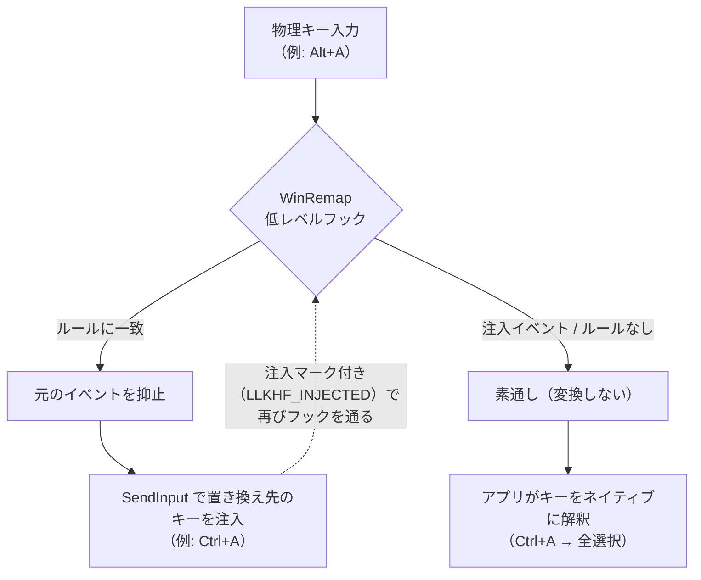

# WinRemap

[](https://github.com/DaikiSuganuma/winremap/actions/workflows/ci.yml)

Rust 製の Windows 用アプリ別キーリマッパー —
[xremap](https://github.com/xremap/xremap)（Linux）と
[Keyhac](https://github.com/crftwr/keyhac-win) に着想を得ています。

> WinRemap は Keyhac の再実装・フォークではなく、影響を受けた独立プロジェクトです。xremap とも無関係です（Inspired by xremap; not affiliated）。

English: [README.md](README.md)

📖 **ヘルプページ:** [daikisuganuma.github.io/winremap/ja/](https://daikisuganuma.github.io/winremap/ja/)
([English](https://daikisuganuma.github.io/winremap/))


## 動作のしくみ

WinRemap がやるのはあくまで**キーストロークの置き換えだけ**で、アプリの機能を直接呼び出すことはありません。低レベルキーボードフックが物理キーイベントを抑止し、`SendInput` で置き換え先のキーを注入します。アプリは注入されたキーを「ユーザーが打ったキー」として受け取り、アプリ自身のネイティブな意味で解釈します。たとえば `A-a` を `C-a` にリマップすれば、アプリの Ctrl+A の動作（通常は全選択）がそのまま動きます。注入イベントはフックを素通しする（再変換しない）ため、ルール同士が連鎖したりループしたりすることはありません。


```mermaid
flowchart TD
    K["物理キー入力<br/>（例: Alt+A）"] --> H{"WinRemap<br/>低レベルフック"}
    H -->|"ルールに一致"| S["元のイベントを抑止"]
    S --> I["SendInput で置き換え先のキーを注入<br/>（例: Ctrl+A）"]
    I -.->|"注入マーク付き（LLKHF_INJECTED）で<br/>再びフックを通る"| H
    H -->|"注入イベント / ルールなし"| P["素通し（変換しない）"]
    P --> A["アプリがキーをネイティブに解釈<br/>（Ctrl+A → 全選択）"]
```

## 機能（v0.7）

- **アプリ別リマップ**: 指定した exe（`notepad.exe`、`chrome.exe` 等）にだけルールを適用。`*` によるグローバル適用と `exclude`（除外リスト）も可
- **宣言的な TOML 設定**。キー記法（`C-h`、`A-f`、`Back` 等）は Keyhac / fakeymacs ユーザーに馴染む形式
- **記号キーは刻印どおりに書けます**（`C-;`、`C-/`）。それがどの物理キーかはキーボードによって違うので、WinRemap は決め打ちせず Windows に問い合わせます — **キーを見れば何を書けばよいか分かります**
- **2 ストロークシーケンス**（`"A-x h"`、Emacs 風プレフィックスキー）と**マクロ出力**（`"C-t" = ["C-Right", "C-Left", "C-S-Right"]`）
- **マクロ記憶**: 記憶キーを押して普段どおり操作し、もう一度押して終了。再生キーで同じ操作を繰り返せます。記憶内容はメモリ上だけに置かれ、ディスクには一切書かれません（WinRemap を終了すると消えます）
- **タスクトレイ常駐**: 有効/無効トグル、設定のホットリロード、終了。起動時にコンソールウィンドウが一瞬も表示されません
- **設定ウィンドウ**: 今まさに効いている設定を確認でき、**その場で編集**できます。キーマップごとの対象アプリ・除外アプリ・リマップ規則を、設定ファイルに書いたコメント付きで表示し、キー記法の凡例も併記します。入力中に記法を検証し、保存前に設定全体を検証し、**触っていない箇所（コメント・空行・並び順・綴り）はそのまま残ります**
- **ログウィンドウ**: ターミナルから起動しなくても、キーごとの処理内容をその場で確認できます。キー 1 つにつき 1 行の簡易表示と、流れた入力をすべて出す詳細表示を切り替えられ、制御コードを持つキーはそれも表示します（`C-h (BS 0x08)`）。ログはディスクに保存されません
- **IME 状態インジケーター**（opt-in）: IME がオンになった瞬間、アクティブウィンドウ中央に半透明の「あ」パネルを一瞬表示し、現在の入力モードを見失わないようにします。パネルが消えたあとに確かめたいとき用に、マウスカーソルの色で示すこともできます。表示のみで、WinRemap が IME を切り替えることはありません
- **UI は日本語・英語対応**。システム言語から自動選択（`--lang en|ja` で上書き可）
- **単一バイナリ・依存なし**
- フックコールバックはヒープ確保・ロック・I/O のない純 Rust。スクリプト駆動のリマッパーと比べ、最悪レイテンシと安定性（GC 停止によるフック切り離しが起きない）が改善します。平均のタイピングレイテンシは同程度です

## クイックスタート

1. インストールします。**公式の入手経路は 2 つ**あり、中身は同じビルドです
   （[SECURITY.md](SECURITY.md)）。**おすすめは Store 版**です。

   **Microsoft Store** — Microsoft が署名するため SmartScreen の警告が出ず、
   更新も自動で届きます:

   > [apps.microsoft.com/detail/9N6TQDXRX5WV](https://apps.microsoft.com/detail/9N6TQDXRX5WV)

   **GitHub Releases** — [Releases](https://github.com/DaikiSuganuma/winremap/releases)
   から `winremap-setup.exe` をダウンロードして実行します。インストーラーは
   管理者権限不要のユーザー単位インストールで、スタートメニューへの登録と
   サインイン時の自動起動（任意）に対応します。こちらのバイナリは
   コード署名していないため、**「Windows によって PC が保護されました」**
   が出ることがあります。信じて実行する代わりに検証する手順（2 コマンド）を
   [SECURITY.md](SECURITY.md) に用意してあります。

   winget からも入れられます（マニフェストの受理後。リリースごとに提出します。
   [Releases](https://github.com/DaikiSuganuma/winremap/releases)
   からのダウンロードは常に即利用可能です）:

   ```powershell
   winget install winremap
   ```

   GitHub Releases の同じ公式バイナリを入れます。マニフェストは
   [`packaging/`](packaging/) を参照してください。

   ポータブル運用にしたい場合は単体の `winremap.exe` をダウンロードするか、
   ソースからビルドしてください:

   ```powershell
   cargo build --release   # -> target\release\winremap.exe
   ```

   どの経路で入れた場合も、**設定ファイルが無ければ初回起動時に作成します**。
   既にある設定ファイルを上書きすることはありません。

2. `%APPDATA%\winremap\config.toml` を編集します（例からのコピーでも可）:

   ```toml
   # メモ帳でのみ Ctrl+H を素の Backspace にする
   [[keymap]]
   name = "notepad"
   application = ["notepad.exe"]

   [keymap.remap]
   "C-h" = "Back"
   ```

3. `winremap.exe` を実行するとトレイアイコンが現れ、リマップが有効になります。

   ```powershell
   winremap.exe                     # %APPDATA%\winremap\config.toml を使用
   winremap.exe --config my.toml    # パスを明示
   ```

> **Store 版の設定ファイルはどこにあるか。** Windows はパッケージアプリに
> `%APPDATA%` の専用コピーを与えるため、Store から新規に入れた場合の設定は
> `%LOCALAPPDATA%\Packages\SUGANUMADaiki.WinRemap_pktmgf1zdhxe0\LocalCache\Roaming\winremap\`
> に置かれます。これを覚えておく必要はありません。設定ウィンドウが**実際に
> 使っているフォルダーを表示し**、エクスプローラーで開くこともできます。
> インストーラー版で作った `%APPDATA%\winremap\config.toml` が既にある場合、
> Store 版はそちらを引き続き使うので、**経路を乗り換えても設定は失われません**。

完全な例は [`examples/minimal.toml`](examples/minimal.toml)、
[`examples/emacs.toml`](examples/emacs.toml)（fakeymacs 風 Emacs キーバインド）、
[`examples/personal-ja.toml`](examples/personal-ja.toml)（除外リスト・マクロ・プレフィックスシーケンスを使った実運用例）を参照してください。

## 設定

- `application` — 適用先の exe 名（大文字小文字不問）。`["*"]` で全アプリ適用となり、その場合のみ `exclude` で除外 exe を指定可。アプリ別ルールは常に `*` ルールより優先
- キー記法 — 修飾キー `C-`（Ctrl）、`A-`（Alt）、`S-`（Shift）、`W-`（Win）+ キー名: `a`-`z`、`0`-`9`、`F1`-`F24`、`Back`、`Enter`、`Esc`、`Tab`、`Space`、`Delete`、`Home`、`End`、`PageUp`、`PageDown`、矢印キー、`CapsLock`、出力用の左右指定修飾キー（`LCtrl` 等）
- 記号キーは**そのキーに刻印されている文字**で書きます（`"C-;"`、`"C-/"`、`"C--"`）。どのキーがそれかはキーボードによって違うため、WinRemap は決め打ちせず Windows に問い合わせます。同じ設定ファイルが US 配列と日本語配列で別の物理キーを指しますが、**どちらもそのキーボードの刻印どおり**になります。`Oem1`〜`Oem8`・`Oem102`・`OemPlus`・`OemComma`・`OemMinus`・`OemPeriod` は、どの配列でも同じキーを指す別名です（設定を別のマシンへ持って行きたい場合に使います）
  > Shift が要る文字は Shift ごと書きます。US 配列の `@` は `Shift`+`2` なので、規則は `"C-@"` ではなく `"C-S-2"` です。WinRemap は黙って Shift を補わず、**書くべき綴りを添えて**エラーにします。
  > キーボードを差し替えたら、トレイメニューの［設定を再読み込み］を選んでください。
- 修飾キー付きルール（`"C-h" = "Back"`）はそのコマンド（修飾キー＋キーの同時押し。英語ドキュメントでは chord）に完全一致し、修飾状態ごと置き換えます（アプリには素の Backspace が届く）。単キールール（`"CapsLock" = "LCtrl"`）は修飾キーの状態に関係なくキーだけを差し替えます
- LHS を 2 ストローク（`"A-x h" = ...`）にすると Emacs 風プレフィックスキーになります（1 打鍵目は抑止され、次の打鍵で確定）。RHS を配列（`["C-Home", "C-S-End"]`、最大 8）にすると各コマンドを順にタップするマクロになります
- `[macro]` セクションの `delay_ms = 8`（0-15）で、マクロの各ストローク間に待ち時間を入れられます。一括注入を取りこぼすアプリ（WinUI 版メモ帳等）向けの設定で、CLI の `--macro-delay` は実験用にこれを上書きします。v0.1 のトップレベル `macro_delay_ms` も引き続き有効です（ADR 0039）
- 設定エラーは行番号付きで全件まとめて報告。壊れた設定をトレイからリロードした場合は直前の設定を維持します
- マクロ記憶のキーも同じ `[macro]` セクションで設定します（下記）

### マクロ記憶（任意）

`[macro]` にキーを書くと、操作を記憶して再生できるようになります。書かない限り機能は動きません。

```toml
[macro]
record_start = "S-F10"  # 記憶開始
# record_stop = "S-F11" # 省略すると開始キーが終了キーも兼ねます
record_play  = "F10"    # 再生
```

`Shift+F10` を押して操作し、もう一度 `Shift+F10` で終了。あとは `F10` で何度でも再生できます。記憶中は、**今入力しているアプリがあるディスプレイ**の下部にバナーが出続けます。

```
マクロ記憶中  3/20   notepad.exe で記憶中   —   S-F10 で終了 / F10 で再生
```

アプリやディスプレイを切り替えるとバナーも追従し、打鍵が入っているアプリ名と、記憶を終了するキー・再生するキーを常に表示します。**気づかないうちに記録が走ることはなく**、終了キーを設定ファイルに確認しに行く必要もありません。再生中も同じバナーに、送出しているコマンドが表示されます。

使う前に知っておくとよいこと:

- **記憶できるのは 20 コマンド**です。1 コマンドは 1 つのキーコンビネーションで、`C-a` は 1 コマンド、`A-x h` の 2 ストロークは 2 コマンドと数えます。21 コマンド目で記憶を打ち切り、その旨を表示します（黙って切り捨てることはありません）
- **ディスクには書きません。** 記憶内容はメモリ上だけにあり、WinRemap を終了すると消えます。設定ファイルにも保存されません。繰り返し使いたい操作は `[keymap.remap]` にマクロとして書いてください
- **記憶されるのは「押したキー」ではなく「WinRemap が出力した内容」**です。`C-h` を `Back` にリマップしていれば、記憶されるのは `Back` です。そのため、後でルールの適用範囲が変わっても再生結果は変わりません
- **記録するのは順序であって、タイミングではありません。** 各コマンドを順に 1 回ずつ叩きます。キーを押していた長さや、押しっぱなしにしながら別のキーを押したことは再現しません（Emacs のキーボードマクロと同じ性質です）
- 記憶は 1 本だけ保持します（記憶し直すと上書き）。再生中に再生キーを押しても二重には走りません。また、WinRemap を無効にしたり設定をリロードしたりすると記憶中の内容は破棄されます（記憶終了キー自体が設定ファイルから来るためです）
- 再生の間隔には `delay_ms` がそのまま使われます

### IME 状態インジケーター（任意）

リマップとは独立した opt-in 機能です。IME がオンになった瞬間、またはIME オンのウィンドウにフォーカスが移った瞬間に、アクティブウィンドウの中央へ半透明の「あ」パネルを一瞬表示します。

```toml
[ime_indicator]
enabled = true                # 既定: false
# trigger_keys = ["C-Space"]  # Ctrl+Space で IME を切り替えている場合
# change_cursor_color = true  # IME がオンの間、マウスカーソルに色を付ける
# cursor_color = "#0078d4"    # その色。既定は WinRemap の青
```

変換/無変換・半角/全角・かな・IME On/Off などの標準 IME キーは設定なしで検知されます。Windows 11 IME の「Ctrl + Space で IME をオン/オフ」のようなユーザー割り当てキーを使っている場合は `trigger_keys`（キー記法）で追加してください。`duration_ms`（100-5000、既定 800）、`size`（32-256、既定 96）、`opacity`（0-255、既定 200）で表示を調整でき、`show_app_name = true` でパネル下に対象アプリの exe 名を表示できます（ウィンドウタイトルは表示しません）。パネルはフォーカスや入力を一切奪わず、タスクバー・デスクトップのクリックでは表示されず、インジケーター側の問題がリマップ動作に影響することはありません。

`change_cursor_color = true` にすると、一瞬のパネルとは別に、**いつでも確かめられる**表示が加わります。IME がオンの間、矢印カーソルと文字入力の I ビームが `cursor_color` の色と白い縁で描かれます。`enabled` とは独立しているのでパネルを出さずにカーソルだけ使えます。管理者権限のウィンドウの上だけは追随しません（制限事項をご覧ください）。既定は無効です — **WinRemap の中だけでなくセッション全体のカーソルを変える**設定だからで、そこから 1 つ知っておいていただきたいことがあります。

> **カーソルに色が付いたままで、トレイに WinRemap が居ない場合、それは WinRemap が強制終了させられたということです。** 色が付くのは IME がオンのときだけなので、残った色を通常の状態と見間違えることはありません。直す操作は要りません — WinRemap をもう一度起動すれば元に戻り、サインアウトして入り直しても戻ります。トレイからの終了、WinRemap 自身が気づける異常終了、`--debug` のウィンドウを閉じた場合は、いずれも終了時に元へ戻します。

全項目の説明・キー記法の一覧・記述例は[設定ガイド](https://daikisuganuma.github.io/winremap/ja/config.html)にあります。開発者向けの仕様書は [docs/v0.1/02_config-spec.md](docs/v0.1/02_config-spec.md) です。

### 今効いている設定を確認する

トレイアイコンを右クリックして「設定」を選ぶと、WinRemap が現在参照している設定が表示されます。キーマップごとの対象アプリ・除外アプリ・リマップ規則が、設定ファイルの同じ行に書いたコメント付きで並びます。同じ入力を複数のキーマップが束縛している場合は、相手のキーマップ名を示す列が出ます（実際に効くのは 1 つだけのためです）。キー記法の凡例も横のペインに表示されます。`[macro]` セクションには記憶キーと、今記憶しているマクロの内容が並びます（後者は設定ファイルには無い内容なので、その旨を添えてあります）。

上部のアドレスバーには設定ファイルのあるフォルダーと、その中の `.toml` の一覧が出ます。別のファイルを選べばそちらへ切り替わります。ファイル名の横の ● は「読み込んだ後にディスク上で変わった」印で、↻ で読み直せます。同じプルダウンから、使い慣れたエディタでファイルを開くこともできます。

### 設定を編集する

［✎ 編集］を押すと、同じウィンドウがそのファイルのエディタになります。名前・対象アプリ・除外アプリ・規則が入力欄になり、キーマップはツリーから追加・削除・並べ替えができ、全体設定はスライダーとチェックボックスで変更できます。

- キー記法の欄は**打ちながら解釈を表示**します（`A-x u` なら「Alt+x に続けて u」）。解釈できない場合はその旨と、既知のキー名に近ければ候補を出します
- ［💾 保存］は**コマンドラインと同じ検証器**で設定全体を検証します。問題があれば何も書かず、行番号付きで下部に一覧します
- 検証を通れば原子的に書き込んで再読み込みするので、閲覧モードに戻った時点で新しい規則が効いています
- **編集していない箇所は 1 バイトも変わりません。** コメント・空行・規則の並び順・書いた綴り・改行コードがそのまま残ります。規則を削除したときに消えるのはその行と行末コメントだけで、上に書いたコメントは次の規則へ引き継がれます
- 編集中に WinRemap の外でファイルが変更された場合、保存は黙って上書きせず確認します。未保存のまま閉じようとしたときも同様で、保存に失敗しても（読み取り専用・空き容量不足など）編集内容は失われません

［⊕ 今の前面アプリから取得］は対象アプリの記入を代行します。押してから 3 秒以内に目的のアプリを前面にすると、その exe 名が一覧に入ります。

ウィンドウを開いている間も、保存の瞬間も、**リマップは止まりません**（規則の差し替えは 1 手で行われます）。

### 何をしているかを見る

トレイアイコンを右クリックして「ログを表示」を選んでください。ウィンドウは読み込み中の設定ファイルを名乗り、そこから先の WinRemap の動きを追います。各行にはミリ秒までの時刻と、どの流れの行かを示すタグが付きます。

```
18:01:51.471 [前面]   application 指定値: "notepad.exe" — 適用されるキーマップ: emacs-keys
18:01:51.517 [判定]   C-h (BS 0x08) → Back (BS 0x08) に置換
```


`[前面]` は「ルールが効かなくなった」ときと、`application` に何を書けばよいか分からないときに読む行です。対象のアプリに切り替えると、**指定すべき値そのもの**と、適用されるキーマップが出ます。`[判定]` はキー 1 つにつき 1 行で、WinRemap がそのキーをどうしたかを言います。

［全イベント］にチェックを入れると、流れた入力をすべて出します。物理キーの押下・解放（`[入力]`）と、それに対して WinRemap が送出したイベント（`[注入]`）です。**リマップは 2 つの時刻に分かれて起きます** — 置換先はキーを押した時に押され、離した時に離されます。時刻の列はそれを見分けるためのものです。記録はチェックの有無にかかわらず取っているので、**チェックを入れると、入れる前に押したキーの詳細も見えます**。

キー名は、あなたのキーボードに合わせて出ます。記号キーはその配列が刻んでいる文字で出るので（`/`）、**そのまま設定ファイルにコピーできます**。規則に書けないキーは括弧付きで生のコードが残り（`Num1 (0x61)`）、それが「まだ書けない」という印です。ASCII 制御コードを持つキー・コマンドは、それも表示します（`C-h (BS 0x08)`、`Enter (CR 0x0D)`、`C-[ (ESC 0x1B)`）。**英数字にはコードを付けません** — WinRemap が記録するのはキーであって、打った内容ではないからです。ディスクにも書きません。

> **Ctrl+H と Backspace、そして端末について** — このプロジェクトの発端になった組み合わせです。端末は **Backspace キー**に対して DEL `0x7f` を、**Ctrl+H** に対して BS `0x08` を送り、アプリはその 2 つに別の動作を割り当てていることがあります（Claude Code は `0x08` で単語削除、`0x7f` で 1 文字削除）。`C-h` を `Back` にリマップすると、端末はどちらでも `0x7f` を送るようになります。ログでは**両側とも `BS 0x08`** と出ますが、これは **Windows が Backspace キーに与えているコード**であり、WinRemap が確かに Backspace キーを届けていることの確認になります。`0x7f` はその先で端末が行う読み替えで、WinRemap からは見えません。

ターミナルから `winremap.exe --debug` で起動すると、同じ内容が時刻・タグ付きでそちらに出ます。**このオプションを付けない場合は何も出力しません** — シェルから起動しても、エクスプローラーから起動したときと同じように静かです。

## 制限事項

- **管理者権限で動作するウィンドウ**には通常権限のフックが効きません（UIPI: User Interface Privilege Isolation）。IME インジケーターとカーソルの色も同じ理由で届きません — IME の状態は相手ウィンドウへのメッセージ送信で読み取るため、これも UIPI に遮断されます。管理者権限のウィンドウが前面のあいだは、パネルも色も出ません。必要な場合のみ WinRemap を管理者権限で起動してください
- **tap/hold・マークモード**は未対応です。シーケンスは 2 ストロークまでです
- **Alt / Win を含むコマンド**は、マスクキーの注入によりメニューバー/スタートメニューの誤発動を防いでいます。特定のアプリで問題が残る場合は報告してください
- アンチチート付きゲームや一部の仮想化ソフトは注入入力を無視することがあります
- 他のキーフック常駐ソフト（Keyhac、AutoHotkey 等）と同じキーを対象にした併用はしないでください（多重フックの順序は不定です）
- `--debug` は専用のコンソールウィンドウを開き、WinRemap の終了後もそのまま残します（起動時と終了時のログを両方読めるようにするためです）。**このウィンドウを閉じると WinRemap も終了します。** 起動元のターミナルのほうは閉じても構いません。`--debug` を付けない場合は何も出力せず、起動完了時にコンソールを切り離すため、ターミナルを閉じても動き続けます。`--help` と `--version` は従来どおり起動元のターミナルへ出力するため、シェルのプロンプトと重なって見えることがあります
- `--debug` の出力をリダイレクトした場合はウィンドウを開かず、そのリダイレクト先へ書き出します。ただし **PowerShell の `>` では失われます** — PowerShell は GUI サブシステムのプロセスを待たないため、WinRemap が常駐に入った時点でパイプを閉じてしまうためです。`cmd /c "winremap.exe --debug > log.txt"` か `Start-Process winremap.exe -ArgumentList '--debug' -RedirectStandardOutput log.txt` をお使いください
- 子プロセスを Job オブジェクト（終了時に道連れにする設定）へ入れるランチャーから起動した場合は、オプションに関わらずランチャーの終了とともに終了します（一部の IDE の統合ターミナルが該当し得ます）
- IME の**制御**は設計上スコープ外です（任意機能のインジケーターは状態の**表示**のみ）。切り替えには Windows 11 の IME 設定をご利用ください
- IME インジケーターはレガシーな IMM32 インターフェースで状態を読み取ります。Windows 11 のモダン Microsoft IME で動作確認済みですが、他社製 IME や将来の IME 変更では照会に応答しない環境があり得ます（その場合は何も表示されません）。管理者権限ウィンドウの状態は取得できず（UIPI）、排他フルスクリーンのアプリでは最前面パネルが表示されないことがあります

## AI エージェントによる開発

WinRemap は主に AI エージェント（Claude Code）が開発し、人間のオーナーがすべての変更をレビュー・承認しています。エージェントに必要な文脈 — [AGENTS.md](AGENTS.md)（規約と不変条件）、[docs/](docs/)（プロジェクトブリーフ・仕様・計画）、バージョン別の `docs/<version>/decisions/`（設計判断の理由を記録した ADR）— がリポジトリに揃っているため、`git clone` して AI エージェントに指示を出すだけで、機能追加も容易です。

## セキュリティ

- WinRemap は**キー入力の記録・保存を行わず**、**ネットワーク通信のコードを含みません**（テレメトリ・自動アップデートなし）。この方針はコードベースの規約として強制されています（[AGENTS.md](AGENTS.md)）
- 公式の配布経路は **2 つ**です。[Microsoft Store](https://apps.microsoft.com/detail/9N6TQDXRX5WV)（Microsoft が署名）と [GitHub Releases](https://github.com/DaikiSuganuma/winremap/releases)（未署名。チェックサムとビルド来歴を検証できます）。他サイトで配布されているバイナリは非公式です。詳細は [SECURITY.md](SECURITY.md) を参照してください

## 謝辞

- [Keyhac](https://sites.google.com/site/craftware/keyhac-ja)（craftware 氏）— 長年の利用を通じて本プロジェクトの出発点となったツール（MIT）
- [fakeymacs](https://github.com/smzht/fakeymacs)（smzht 氏）— Keyhac 用の Emacs 風キーバインド設定集（MIT）
- [xremap](https://github.com/xremap/xremap) — Linux におけるアプリ別リマップのアーキテクチャ参考（MIT）
- [Bootstrap Icons](https://icons.getbootstrap.com/) — トレイメニューのアイコン（MIT）。`assets/icons/` の SVG をビルド時にラスタライズして使用

## ライセンス

[MIT](LICENSE) — Copyright (c) 2026 Daiki Suganuma

Bootstrap Icons も MIT ライセンスです。ラスタライズした画素が `winremap.exe` に
埋め込まれるため、著作権表示とライセンス文を配布物に同梱しています
（[THIRD-PARTY-NOTICES.md](THIRD-PARTY-NOTICES.md)）。
