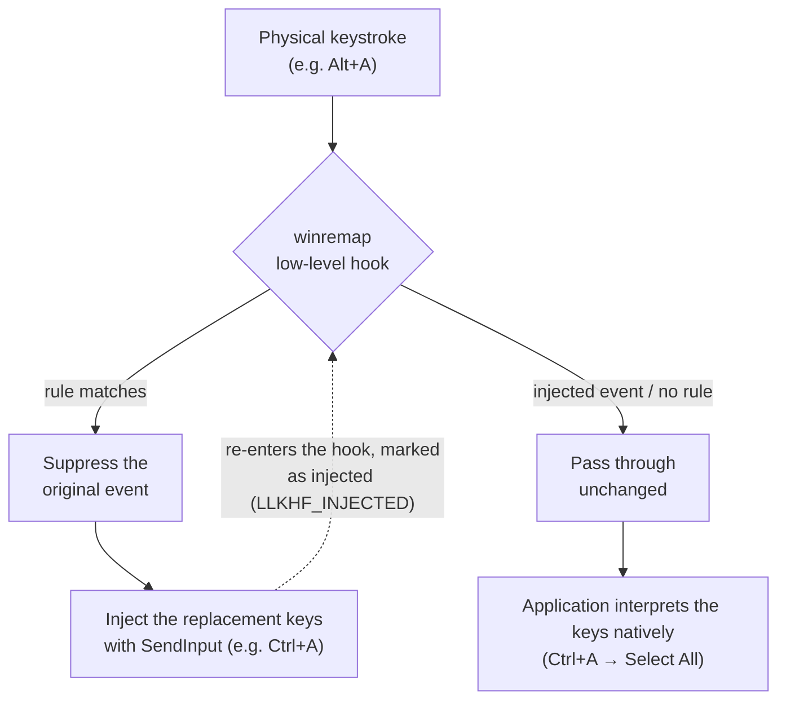

# winremap

[](https://github.com/DaikiSuganuma/winremap/actions/workflows/ci.yml)

A per-application key remapper for Windows, written in Rust — inspired by
[xremap](https://github.com/xremap/xremap) (Linux) and
[Keyhac](https://github.com/crftwr/keyhac-win).

> winremap is an independent project influenced by Keyhac — not a
> reimplementation or fork of it. It is also not affiliated with xremap.

日本語版: [README.ja.md](README.ja.md)

## How it works

All winremap does is replace keystrokes — it never invokes application
functions directly. A low-level keyboard hook suppresses the physical key
event and injects the replacement keys with `SendInput`. The application
receives the injected keys as if you had typed them and applies its own
native meaning: remap `A-a` to `C-a` and the app runs whatever it does for
Ctrl+A (usually Select All). Injected events pass through the hook
untouched, so rules never trigger each other or loop.



## Features (v0.1)

- **Per-application remapping**: rules apply only to the processes you list
  (`notepad.exe`, `chrome.exe`, ...), or globally (`*`) with an optional
  `exclude` list
- **Declarative TOML config** with Emacs-style key notation (`C-h`, `A-f`,
  `Back`, ...) familiar to Keyhac/fakeymacs users
- **Two-stroke sequences** (`"A-x h"`, Emacs-style prefix keys) and **macro
  outputs** (`"C-t" = ["C-Right", "C-Left", "C-S-Right"]`)
- **Task tray resident**: enable/disable toggle, config hot-reload, quit
- **IME status indicator** (opt-in): the moment the IME turns on, a
  translucent "あ" panel flashes at the center of the active window so you
  always know the input mode — display only; winremap never switches the IME
- **Japanese and English UI**, auto-detected from the system language
  (`--lang en|ja` to override)
- **Single binary, no runtime dependencies**
- The hook callback runs in pure Rust with no heap allocation, locking, or
  I/O. Compared to script-driven remappers this improves worst-case latency
  and stability (no GC pauses that can get a low-level hook disconnected by
  Windows); average typing latency is similar

## Quick start

1. Download `winremap.exe` and `SHA256SUMS` from
   [Releases](https://github.com/DaikiSuganuma/winremap/releases)
   (see [SECURITY.md](SECURITY.md) for verification), or build from source:

   ```powershell
   cargo build --release   # -> target\release\winremap.exe
   ```

2. Create `%APPDATA%\winremap\config.toml` (or start with an example):

   ```toml
   # Ctrl+H sends a plain Backspace, but only inside Notepad
   [[keymap]]
   name = "notepad"
   application = ["notepad.exe"]

   [keymap.remap]
   "C-h" = "Back"
   ```

3. Run `winremap.exe`. A tray icon appears; remapping is active.

   ```powershell
   winremap.exe                     # uses %APPDATA%\winremap\config.toml
   winremap.exe --config my.toml    # explicit path
   ```

See [`examples/minimal.toml`](examples/minimal.toml),
[`examples/emacs.toml`](examples/emacs.toml) (fakeymacs-style Emacs
bindings), and [`examples/suganuma.toml`](examples/suganuma.toml) (a full
personal setup using exclusion lists, macros, and prefix sequences) for
complete examples.

## Configuration

- `application` — exe names the section applies to (case-insensitive), or
  `["*"]` for all applications; a global section may list `exclude` exe
  names. App-specific rules always win over `*` rules.
- Key notation — modifiers `C-` (Ctrl), `A-` (Alt), `S-` (Shift), `W-` (Win)
  plus a key name: `a`-`z`, `0`-`9`, `F1`-`F24`, `Back`, `Enter`, `Esc`,
  `Tab`, `Space`, `Delete`, `Home`, `End`, `PageUp`, `PageDown`, arrow keys,
  `CapsLock`, and side-specific modifiers (`LCtrl`, ...) as outputs.
- A rule with modifiers (`"C-h" = "Back"`) matches that exact chord and
  replaces the modifier state too (the app receives a plain Backspace). A
  bare-key rule (`"CapsLock" = "LCtrl"`) swaps the key regardless of held
  modifiers.
- A two-stroke LHS (`"A-x h" = ...`) defines an Emacs-style prefix: the
  first chord is swallowed and the next keystroke completes the binding.
  An array RHS (`["C-Home", "C-S-End"]`, up to 8) taps each chord in order.
- Top-level `macro_delay_ms = 8` (0-15) paces macro strokes for apps that
  drop burst-injected input (e.g. the WinUI Notepad); the `--macro-delay`
  CLI flag overrides it for experiments.
- Config errors are reported with line numbers, all at once. Reloading a
  broken config from the tray keeps the previous working config.

### IME status indicator (optional)

Independent of remapping, an opt-in `[ime_indicator]` section shows the
input mode: when the IME turns on — or you focus a window whose IME is on —
a translucent "あ" panel flashes at the center of the active window.

```toml
[ime_indicator]
enabled = true                # default: false
# trigger_keys = ["C-Space"]  # if you toggle the IME with Ctrl+Space
```

Standard IME keys (Henkan/Muhenkan, Zenkaku/Hankaku, Kana, IME On/Off) are
detected out of the box; add `trigger_keys` (key notation) for user-assigned
toggles such as the Windows 11 IME's Ctrl+Space option. `duration_ms`
(100-5000, default 800), `size` (32-256, default 96), and `opacity` (0-255,
default 200) tune the panel. The panel never takes focus or input, and a
problem in the indicator never affects remapping.

The full specification lives in
[docs/04_config-spec.md](docs/04_config-spec.md) (Japanese).

Not sure what to put in `application`? Run `winremap.exe --debug` and switch
windows: it prints each foreground app's full path, the exact `application`
value to use, and which of your keymaps would apply.

## Limitations

- **Windows with elevated privileges** (admin) do not receive events from a
  non-elevated hook (UIPI, User Interface Privilege Isolation). Run winremap
  elevated only if you need remapping there.
- **Punctuation/OEM keys** (`;`, `,`, ...) are not supported yet — their
  virtual-key codes are keyboard-layout dependent.
- **No tap/hold or mark mode** yet; sequences are limited to two strokes.
- Chords involving **Alt or Win** inject a masking key so the modifier lift
  does not pop the menu bar / Start menu; if a specific app still shows menu
  flicker, please report it.
- Games with anti-cheat and some virtualization software may ignore injected
  input.
- Do not run winremap together with other keyboard-hook software (Keyhac,
  AutoHotkey, ...) remapping the same keys — stacked low-level hooks have
  undefined ordering.
- winremap keeps a console window in v0.1 (reload errors are printed there).
- IME **control** is out of scope by design (the optional indicator only
  *displays* the state); use the Windows 11 IME settings.
- The IME indicator reads the state via the legacy IMM32 interface. It is
  verified against the modern Microsoft IME on Windows 11, but some IME
  environments (non-Microsoft IMEs, or future IME changes) may not answer
  the query — the indicator then quietly shows nothing. It also cannot read
  the state of elevated windows (UIPI), and exclusive-fullscreen apps may
  hide the topmost panel.

## Security

- winremap **never logs or stores keystrokes** and contains **no network
  code** (no telemetry, no auto-update). The code base enforces this by
  policy; see [AGENTS.md](AGENTS.md).
- Official binaries are distributed **only** via
  [GitHub Releases](https://github.com/DaikiSuganuma/winremap/releases).
  Binaries obtained anywhere else are unofficial — verify checksums and
  build provenance as described in [SECURITY.md](SECURITY.md).

## Acknowledgments

- [Keyhac](https://sites.google.com/site/craftware/keyhac-ja) by craftware —
  the long-serving tool this project's workflow grew out of (MIT)
- [fakeymacs](https://github.com/smzht/fakeymacs) by smzht — Emacs-style
  keybinding configuration for Keyhac (MIT)
- [xremap](https://github.com/xremap/xremap) — the architectural reference
  for per-application remapping on Linux (MIT)

## License

[MIT](LICENSE) — Copyright (c) 2026 Daiki Suganuma
