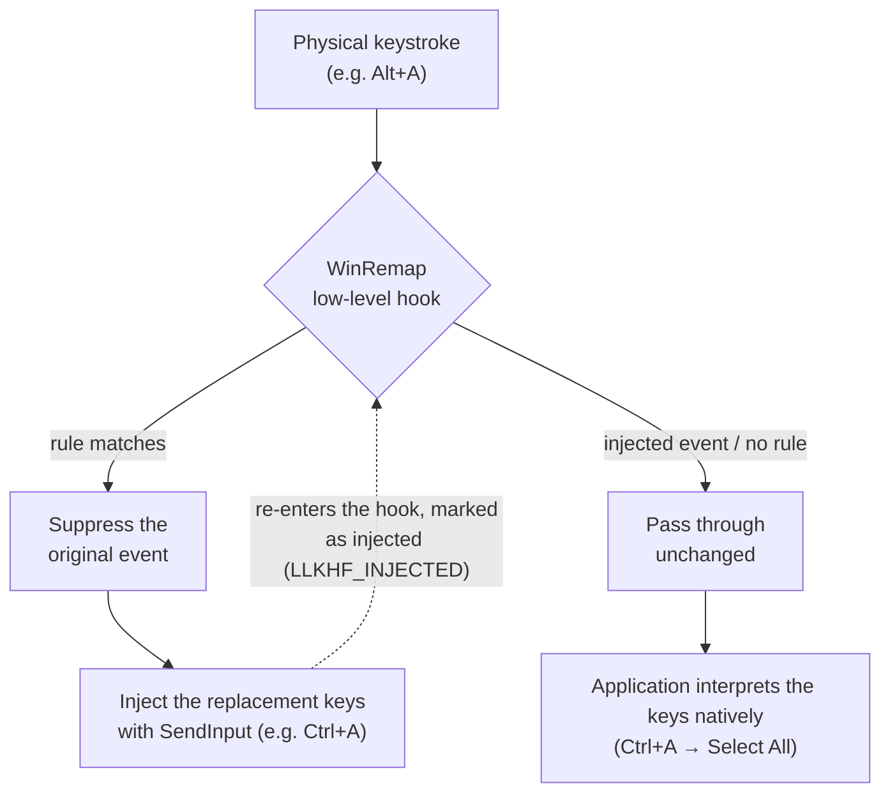

# WinRemap

[](https://github.com/DaikiSuganuma/winremap/actions/workflows/ci.yml)

A per-application key remapper for Windows, written in Rust — inspired by
[xremap](https://github.com/xremap/xremap) (Linux) and
[Keyhac](https://github.com/crftwr/keyhac-win).

> WinRemap is an independent project influenced by Keyhac — not a
> reimplementation or fork of it. It is also not affiliated with xremap.

日本語版: [README.ja.md](README.ja.md)

📖 **User guide / help:** [daikisuganuma.github.io/winremap](https://daikisuganuma.github.io/winremap/)
([日本語](https://daikisuganuma.github.io/winremap/ja/))


## How it works

All WinRemap does is replace keystrokes — it never invokes application
functions directly. A low-level keyboard hook suppresses the physical key
event and injects the replacement keys with `SendInput`. The application
receives the injected keys as if you had typed them and applies its own
native meaning: remap `A-a` to `C-a` and the app runs whatever it does for
Ctrl+A (usually Select All). Injected events pass through the hook
untouched, so rules never trigger each other or loop.


```mermaid
flowchart TD
    K["Physical keystroke<br/>(e.g. Alt+A)"] --> H{"WinRemap<br/>low-level hook"}
    H -->|"rule matches"| S["Suppress the<br/>original event"]
    S --> I["Inject the replacement keys<br/>with SendInput (e.g. Ctrl+A)"]
    I -.->|"re-enters the hook, marked<br/>as injected (LLKHF_INJECTED)"| H
    H -->|"injected event / no rule"| P["Pass through<br/>unchanged"]
    P --> A["Application interprets the keys natively<br/>(Ctrl+A → Select All)"]
```

## Features (v0.7)

- **Per-application remapping**: rules apply only to the processes you list
  (`notepad.exe`, `chrome.exe`, ...), or globally (`*`) with an optional
  `exclude` list
- **Declarative TOML config** with Emacs-style key notation (`C-h`, `A-f`,
  `Back`, ...) familiar to Keyhac/fakeymacs users
- **Symbol keys written as they are engraved** (`C-;`, `C-/`): which physical
  key that is depends on your keyboard, and WinRemap asks Windows instead of
  guessing — so the notation matches what you can see on the key
- **Two-stroke sequences** (`"A-x h"`, Emacs-style prefix keys) and **macro
  outputs** (`"C-t" = ["C-Right", "C-Left", "C-S-Right"]`)
- **Macro recording**: press a key to start recording, work as usual, press
  it again to stop, and a replay key repeats what you did. The recording
  lives in memory only — nothing is written to disk, and it is gone when
  WinRemap exits
- **Task tray resident**: enable/disable toggle, config hot-reload, quit.
  Launching never flashes a console window
- **Settings window**: see the config that is in effect right now — every
  keymap, its target apps and its rules, with your own comments beside them
  and a key-notation legend — and **edit it in place**. Rules are checked as
  you type, saving validates before it writes, and everything you did not
  touch (comments, blank lines, ordering, spellings) comes back unchanged
- **Log window**: watch WinRemap decide, key by key, without starting it from
  a terminal — one line per key, or the whole stream when you ask for it,
  with the control code a key carries (`C-h (BS 0x08)`) where there is one.
  Nothing is ever written to disk
- **IME status indicator** (opt-in): the moment the IME turns on, a
  translucent "あ" panel flashes at the center of the active window so you
  always know the input mode — and the mouse cursor can carry the state too,
  for the times you look after the flash is gone. Display only; WinRemap
  never switches the IME
- **Japanese and English UI**, auto-detected from the system language
  (`--lang en|ja` to override)
- **Single binary, no runtime dependencies**
- The hook callback runs in pure Rust with no heap allocation, locking, or
  I/O. Compared to script-driven remappers this improves worst-case latency
  and stability (no GC pauses that can get a low-level hook disconnected by
  Windows); average typing latency is similar

## Quick start

1. Install it. Both channels are official and carry the same build (see
   [SECURITY.md](SECURITY.md)); **the Store is the recommended one**.

   **Microsoft Store** — signed by Microsoft, so Windows installs it without
   a SmartScreen warning, and it updates itself:

   > [apps.microsoft.com/detail/9N6TQDXRX5WV](https://apps.microsoft.com/detail/9N6TQDXRX5WV)

   **GitHub Releases** — download `winremap-setup.exe` from
   [Releases](https://github.com/DaikiSuganuma/winremap/releases) and run it.
   The installer needs no admin rights: it installs per-user, adds a Start
   Menu shortcut, and can start WinRemap at sign-in. These binaries are not
   code-signed, so Windows may show *"Windows protected your PC"* for a new
   download — [SECURITY.md](SECURITY.md) has the two commands that verify a
   download instead of trusting it.

   winget works too (a manifest is submitted after every release, so it can
   trail the newest version by a few days; the
   [Releases](https://github.com/DaikiSuganuma/winremap/releases) download
   always works right away):

   ```powershell
   winget install DaikiSuganuma.WinRemap
   ```

   It installs the same official binaries from GitHub Releases — see
   [`packaging/`](packaging/) for the manifest. **Use the full id**: the name
   `winremap` matches the Store listing as well, and winget refuses an
   ambiguous query. `winget install 9N6TQDXRX5WV` is the Store one.

   Prefer a portable setup? Download the single `winremap.exe` instead, or
   build from source:

   ```powershell
   cargo build --release   # -> target\release\winremap.exe
   ```

   Whichever route you take, WinRemap creates a starter config on first run
   if you have none. Your existing config is never overwritten.

2. Edit `%APPDATA%\winremap\config.toml` (or start with an example):

   ```toml
   # Ctrl+H sends a plain Backspace, but only inside Notepad
   [[keymap]]
   name = "notepad"
   application = ["notepad.exe"]

   [keymap.remap]
   "C-h" = "Back"
   ```

3. Run `winremap.exe`. A tray icon appears; remapping is active.

   ```powershell
   winremap.exe                     # uses %APPDATA%\winremap\config.toml
   winremap.exe --config my.toml    # explicit path
   ```

> **Store version: where is my config?** Windows gives packaged apps their own
> private copy of `%APPDATA%`, so a fresh Store install keeps the file under
> `%LOCALAPPDATA%\Packages\SUGANUMADaiki.WinRemap_pktmgf1zdhxe0\LocalCache\Roaming\winremap\`.
> You never have to remember that: the settings window names the folder it is
> actually using and opens it in Explorer for you. If you already had
> `%APPDATA%\winremap\config.toml` from the installer, the Store version keeps
> using that file, so switching channels does not lose your rules.

See [`examples/minimal.toml`](examples/minimal.toml),
[`examples/emacs.toml`](examples/emacs.toml) (fakeymacs-style Emacs
bindings), and [`examples/personal-ja.toml`](examples/personal-ja.toml) (a full
personal setup using exclusion lists, macros, and prefix sequences) for
complete examples.

## Configuration

- `application` — exe names the section applies to (case-insensitive), or
  `["*"]` for all applications; a global section may list `exclude` exe
  names. App-specific rules always win over `*` rules.
- Key notation — modifiers `C-` (Ctrl), `A-` (Alt), `S-` (Shift), `W-` (Win)
  plus a key name: `a`-`z`, `0`-`9`, `F1`-`F24`, `Back`, `Enter`, `Esc`,
  `Tab`, `Space`, `Delete`, `Home`, `End`, `PageUp`, `PageDown`, arrow keys,
  `CapsLock`, and side-specific modifiers (`LCtrl`, ...) as outputs.
- Symbol keys are written as **the character printed on the key**: `"C-;"`,
  `"C-/"`, `"C--"`. Which key that is depends on your keyboard, and WinRemap
  asks Windows rather than assuming — so the same file means different
  physical keys on a US and a Japanese keyboard, matching what is engraved on
  each. `Oem1`-`Oem8`, `Oem102`, `OemPlus`, `OemComma`, `OemMinus` and
  `OemPeriod` name those keys the same way on every layout, for a config you
  want to carry between machines.
  > A character that needs Shift is written with it: on a US keyboard `@` is
  > `Shift`+`2`, so the rule is `"C-S-2"`, not `"C-@"`. WinRemap says so, with
  > the spelling to use, rather than silently adding the Shift for you.
  > Changed keyboards? Pick **Reload config** from the tray menu.
- A rule with modifiers (`"C-h" = "Back"`) matches that exact chord and
  replaces the modifier state too (the app receives a plain Backspace). A
  bare-key rule (`"CapsLock" = "LCtrl"`) swaps the key regardless of held
  modifiers.
- A two-stroke LHS (`"A-x h" = ...`) defines an Emacs-style prefix: the
  first chord is swallowed and the next keystroke completes the binding.
  An array RHS (`["C-Home", "C-S-End"]`, up to 8) taps each chord in order.
- `[macro]` `delay_ms = 8` (0-15) paces macro strokes for apps that
  drop burst-injected input (e.g. the WinUI Notepad); the `--macro-delay`
  CLI flag overrides it for experiments. The same section configures macro
  recording (below).
- Config errors are reported with line numbers, all at once. Reloading a
  broken config from the tray keeps the previous working config.

### Macro recording (optional)

Name the keys in `[macro]` and WinRemap can record what you do and play it
back. Nothing happens until you name them.

```toml
[macro]
record_start = "S-F10"  # press to start recording
# record_stop = "S-F11" # omit it and the start key stops it too
record_play  = "F10"    # press to replay
```

Press `Shift+F10`, do the work, press `Shift+F10` again, then press `F10` as
often as you like. While a recording runs, a banner sits at the bottom of
whichever display holds the app you are typing into:

```
Recording macro  3/20   notepad.exe in progress   —   S-F10 to stop, F10 to replay
```

It follows you as you switch apps and displays, names the app receiving the
keystrokes, and repeats the keys that end and replay the recording — so a
recording never runs unnoticed, and you never have to open the config file
to find out how to stop it. Replay shows the same banner with the commands
it is sending.

What is worth knowing before relying on it:

- **The recording holds 20 commands.** A command is one chord: `C-a` is one,
  and the two strokes of `A-x h` are two. The 21st ends the recording and
  says so — nothing is dropped quietly.
- **Nothing is written to disk.** The recording lives in memory and is gone
  when WinRemap exits. It is not saved to your config file either. If you
  want to keep a sequence, write it as a macro rule in `[keymap.remap]`.
- **What is recorded is what WinRemap emitted**, not the keys you pressed.
  If `C-h` is remapped to `Back`, the recording holds `Back` — so a replay
  does the same thing whether or not the rule still applies.
- **Order, not timing.** Each command is tapped once, in order. How long you
  held a key, and holding one key while pressing another, are not
  reproduced. Emacs keyboard macros behave the same way.
- Only one recording is kept; recording again replaces it. The replay key
  does nothing while a replay is still running, and recording is dropped if
  you disable WinRemap or reload the config — the keys that would end it
  come from that file.
- `delay_ms` paces a replay just as it paces a config macro.

### IME status indicator (optional)

Independent of remapping, an opt-in `[ime_indicator]` section shows the
input mode: when the IME turns on — or you focus a window whose IME is on —
a translucent "あ" panel flashes at the center of the active window.

```toml
[ime_indicator]
enabled = true                # default: false
# trigger_keys = ["C-Space"]  # if you toggle the IME with Ctrl+Space
# change_cursor_color = true  # colour the mouse cursor while the IME is on
# cursor_color = "#0078d4"    # the colour, default WinRemap's blue
```

Standard IME keys (Henkan/Muhenkan, Zenkaku/Hankaku, Kana, IME On/Off) are
detected out of the box; add `trigger_keys` (key notation) for user-assigned
toggles such as the Windows 11 IME's Ctrl+Space option. `duration_ms`
(100-5000, default 800), `size` (32-256, default 96), and `opacity` (0-255,
default 200) tune the panel, and `show_app_name = true` adds the target
app's exe name under the glyph (never the window title). The panel never
takes focus or input, taskbar/desktop clicks are ignored, and a problem in
the indicator never affects remapping.

`change_cursor_color = true` turns that one-off flash into something you can
check at any moment: while the IME is on, the arrow and the text I-beam are
drawn in `cursor_color` with a white border. It is independent of `enabled`,
so you can have the cursor without the panel. Elevated windows are the one
place it does not follow — see Limitations. Off by default, because it changes
the cursor **for the whole session** rather than only inside WinRemap — which
is worth one paragraph of its own:

> **A coloured cursor with no WinRemap in the tray means WinRemap was
> killed.** The colour is only ever applied while the IME is on, so a colour
> left behind cannot be mistaken for normal. Nothing needs repairing: start
> WinRemap again and the cursor goes back, and so does signing out and back
> in. Quitting from the tray, a crash WinRemap can still see, and closing the
> `--debug` window all restore it on the way out.

Every option, the full key-notation table and worked examples live in the
[configuration guide](https://daikisuganuma.github.io/winremap/config.html);
the developer-facing specification is
[docs/v0.1/02_config-spec.md](docs/v0.1/02_config-spec.md) (Japanese).

### Seeing what is in effect

Right-click the tray icon and pick **Settings** to see the config WinRemap is
resolving against right now: every keymap, its target apps and exclusions, and
its rules — each with the comment you wrote beside it in the file. Where the
same input is bound in more than one keymap, a column names the others, since
only one of them can win. A key-notation legend sits beside the rules, and
the `[macro]` section lists the recording keys plus whatever is recorded
right now — marked as memory-only, since it is not in the file.

The address bar at the top names the folder your config lives in and lists the
`.toml` files beside it: pick another one and WinRemap switches to it. A ●
next to a file name means it changed on disk since it was loaded — press ↻ to
reload, or open the file in your usual editor from the same dropdown.

### Editing it

Press **Edit** and the same window becomes an editor for the file. Names,
target apps, exclusions and rules turn into fields; keymaps can be added,
deleted and reordered from the tree; the general settings sit on sliders and
checkboxes.

- Each key-notation field says what it reads as while you type — `A-x u`
  shows "Alt+x, then u" — and marks what it cannot parse, with a suggestion
  when the key name is close to a real one.
- **Save** validates the whole file with the same parser the command line
  uses. If anything is wrong nothing is written; the problems are listed at
  the bottom with their line numbers.
- A valid save is written atomically and reloaded, so the new rules are in
  effect before the window returns to viewing.
- **Everything you did not edit stays byte for byte as it was**: comments,
  blank lines, the order of your rules, the spelling you used, and the file's
  line endings. Deleting a rule takes its line and the comment on that line,
  and leaves the comments above it for the rule that follows.
- If the file changed outside WinRemap while you were editing, Save stops and
  asks rather than overwriting. Closing with unsaved changes asks too, and a
  save that fails (read-only file, no space) keeps your edits.

**Capture the foreground app** fills in an application name for you: press
it, bring the app you mean to the front within three seconds, and its exe
name lands on the list.

Remapping never pauses while the window is open, or while a save is going
through — the running rules are swapped in one step.

### Watching what it does

Right-click the tray icon and pick **Show log**. The window says which config
file is loaded and then follows what WinRemap does. Every line carries the
time to the millisecond and a tag saying which stream it belongs to:

```
18:01:51.471 [window]   application = "notepad.exe" — matching keymaps: emacs-keys
18:01:51.517 [decided]  C-h (BS 0x08) → remapped to Back (BS 0x08)
```


`[window]` is what to read when a rule "stopped working", and when you are
not sure what to put in `application`: switch to the app you mean and the log
names the exact value to use and which of your keymaps reach it. `[decided]`
is one line per key — what WinRemap did with it.

Tick **Every event** for the whole stream instead: every physical press and
release (`[input]`) and everything WinRemap sent in reply (`[injected]`). The
two halves of a remap happen at different moments — the target is pressed
when you press the key and released when you let go — which is what the time
column is for. Everything is recorded whether the box is ticked or not, so
ticking it explains the keys you already pressed, not just the next ones.

Keys are named the way your keyboard is: punctuation reads as the character
your layout prints on the key, so `/` — exactly what you would write in a
rule, ready to copy into the file. A key you *cannot* name in a rule keeps
its raw code in parentheses (`Num1 (0x61)`); that is the signal. Where a key
or a chord carries an ASCII control code the log says so — `C-h (BS 0x08)`,
`Enter (CR 0x0D)`, `C-[ (ESC 0x1B)`. Letters and digits never show a code:
WinRemap logs keys, not what you typed, and nothing goes to disk.

> **Ctrl+H, Backspace, and terminals** — the pair this project started from.
> A terminal sends DEL `0x7f` when you press the Backspace *key* and BS
> `0x08` for Ctrl+H, and an application may bind the two to different things
> (Claude Code deletes a word on `0x08`, a character on `0x7f`). Remapping
> `C-h` to `Back` is what makes your terminal send `0x7f` for both. In the log
> both sides read `BS 0x08`, because that is the code Windows itself gives the
> Backspace key — which is how you can see that WinRemap really is delivering
> the Backspace key. The `0x7f` is the terminal's own doing, further down the
> line, and WinRemap cannot see it.

Start WinRemap with `winremap.exe --debug` from a terminal and the same lines
go there instead, stamps and tags included. **Without that flag it prints
nothing** — starting it from a shell is as quiet as starting it from Explorer.

## Limitations

- **Windows with elevated privileges** (admin) do not receive events from a
  non-elevated hook (UIPI, User Interface Privilege Isolation). The IME
  indicator and the coloured cursor are blind there for the same reason: the
  IME state is read by messaging the target window, and UIPI blocks that too,
  so neither the panel nor the colour appears while an elevated window is in
  front. Run WinRemap elevated only if you need any of this there.
- **No tap/hold or mark mode** yet; sequences are limited to two strokes.
- Chords involving **Alt or Win** inject a masking key so the modifier lift
  does not pop the menu bar / Start menu; if a specific app still shows menu
  flicker, please report it.
- Games with anti-cheat and some virtualization software may ignore injected
  input.
- Do not run WinRemap together with other keyboard-hook software (Keyhac,
  AutoHotkey, ...) remapping the same keys — stacked low-level hooks have
  undefined ordering.
- `--debug` opens a console window of its own and keeps it after WinRemap is
  done, so the startup and shutdown lines can both be read; closing that
  window ends WinRemap. The terminal you launched from is free to close.
  Without `--debug` nothing is printed and WinRemap lets that console go once
  it is up, so it keeps running after the terminal closes. `--help` and
  `--version` still print to the launching terminal, where the shell's prompt
  may repaint over them.
- Redirecting `--debug` writes the transcript to the destination instead of
  opening a window, but **neither shell's `>` can do it**. PowerShell's closes
  the pipe as soon as WinRemap goes resident, because it does not wait for a
  GUI-subsystem process; `cmd`'s never reaches WinRemap at all, because cmd
  redirects by swapping its own standard handles rather than passing
  `STARTF_USESTDHANDLES`, and Windows does not hand those to a GUI-subsystem
  child — so a window opens and the file stays empty. Use
  `Start-Process winremap.exe -ArgumentList '--debug' -RedirectStandardOutput log.txt`
  (Git Bash's `>` works too).
- A launcher that puts its children in a job object with kill-on-close (some
  IDE terminals do) still takes WinRemap down with it, whatever the flags.
- IME **control** is out of scope by design (the optional indicator only
  *displays* the state); use the Windows 11 IME settings.
- The IME indicator reads the state via the legacy IMM32 interface. It is
  verified against the modern Microsoft IME on Windows 11, but some IME
  environments (non-Microsoft IMEs, or future IME changes) may not answer
  the query — the indicator then quietly shows nothing. It also cannot read
  the state of elevated windows (UIPI), and exclusive-fullscreen apps may
  hide the topmost panel.

## AI-assisted development

WinRemap is developed primarily by AI agents (Claude Code), with a human
owner reviewing and accepting every change. The repository carries the full
context an agent needs — [AGENTS.md](AGENTS.md) (conventions and
invariants), [docs/](docs/) (project brief, specs, plans), and the
per-version `docs/<version>/decisions/` folders (ADRs recording why things
are the way they are). Extending WinRemap is therefore easy: `git clone` the
repository, point your AI agent at it, and describe the feature you want.

## Security

- WinRemap **never logs or stores keystrokes** and contains **no network
  code** (no telemetry, no auto-update). The code base enforces this by
  policy; see [AGENTS.md](AGENTS.md).
- Official builds come from **two** channels: the
  [Microsoft Store](https://apps.microsoft.com/detail/9N6TQDXRX5WV) (signed by
  Microsoft) and
  [GitHub Releases](https://github.com/DaikiSuganuma/winremap/releases)
  (unsigned; verify checksums and build provenance). Binaries obtained
  anywhere else are unofficial — see [SECURITY.md](SECURITY.md).

## Acknowledgments

- [Keyhac](https://sites.google.com/site/craftware/keyhac-ja) by craftware —
  the long-serving tool this project's workflow grew out of (MIT)
- [fakeymacs](https://github.com/smzht/fakeymacs) by smzht — Emacs-style
  keybinding configuration for Keyhac (MIT)
- [xremap](https://github.com/xremap/xremap) — the architectural reference
  for per-application remapping on Linux (MIT)
- [Bootstrap Icons](https://icons.getbootstrap.com/) — the tray menu icons
  (MIT), rasterized at build time from the SVGs in `assets/icons/`

## License

[MIT](LICENSE) — Copyright (c) 2026 Daiki Suganuma

Bootstrap Icons is MIT too, and its pixels are embedded in `winremap.exe`, so
its notice ships with the binary: see
[THIRD-PARTY-NOTICES.md](THIRD-PARTY-NOTICES.md).
